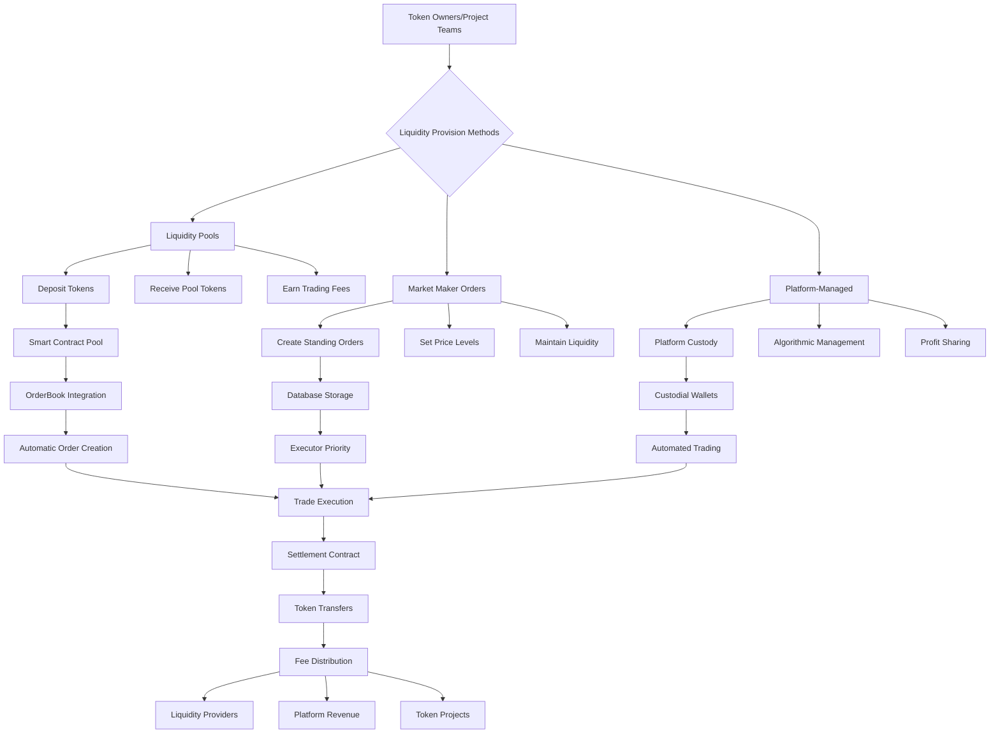

# Liquidity Provision Approaches - Architecture Diagram

## Approach Comparison

| Approach | Complexity | Control | Gas Cost | User Experience |
|----------|------------|---------|----------|-----------------|
| Liquidity Pools | High | Medium | Medium | Passive |
| Market Maker Orders | Medium | High | Low | Active |
| Platform-Managed | Low | Low | High | Hands-off |

## Recommended Implementation Order

1. **Start with Market Maker Orders** - Easiest to implement, gives immediate liquidity
2. **Add Liquidity Pools** - For passive provision, higher capital efficiency
3. **Platform-Managed** - For tokens needing immediate liquidity

## Integration Points

- **OrderBook.sol**: Extend for market maker privileges
- **Settlement.sol**: Handle pool-based settlements
- **Executor.js**: Priority matching for liquidity orders
- **Database**: New tables for pools and positions
- **Frontend**: Liquidity management dashboard