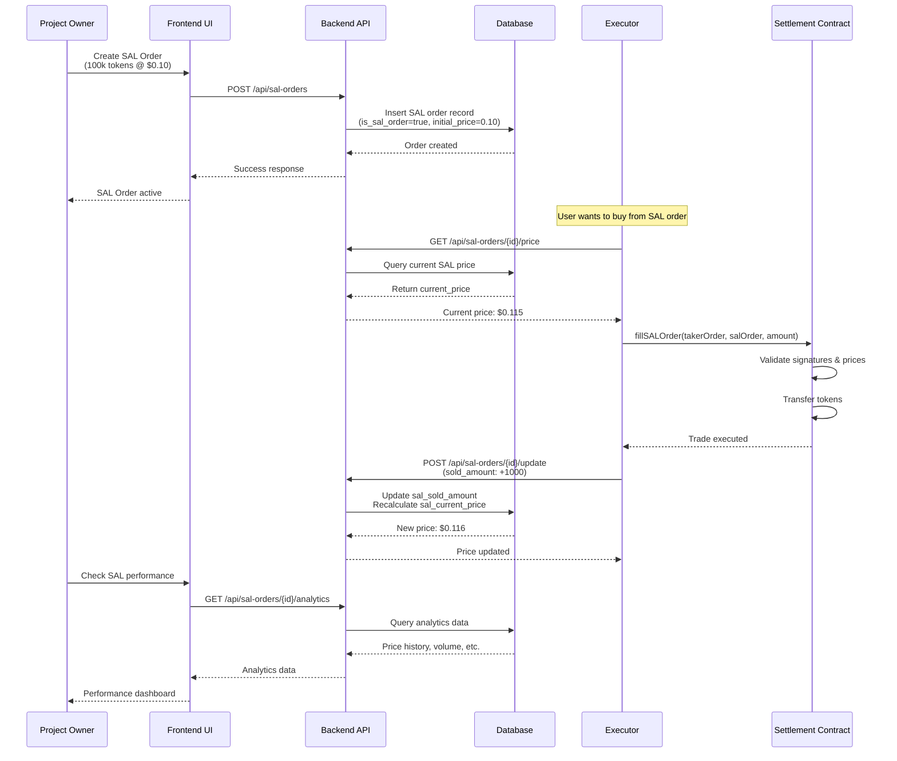
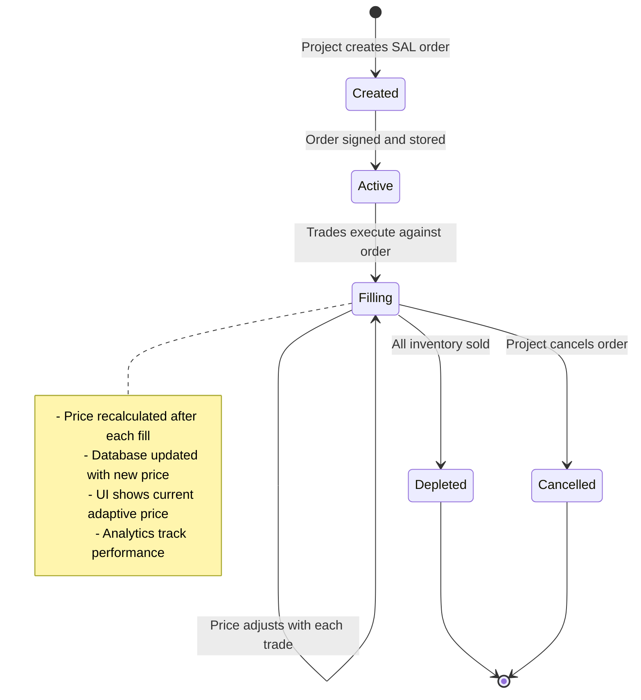
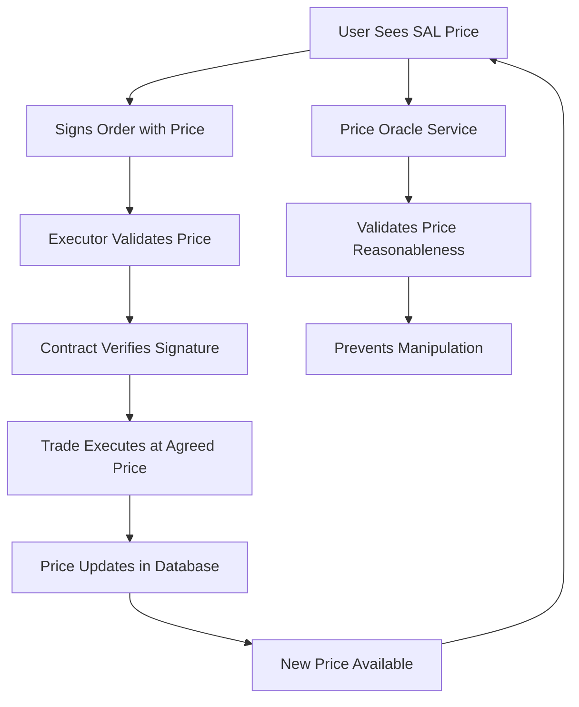

# SAL Order Flow Architecture



## SAL Order State Flow



## Price Adjustment Curves

### Linear Curve Example
```
Initial: 10,000 tokens @ $1.00
After 2,000 sold: 8,000 tokens @ $1.20  (20% through inventory)
After 5,000 sold: 5,000 tokens @ $1.50  (50% through inventory)
After 8,000 sold: 2,000 tokens @ $1.80  (80% through inventory)
```

### Exponential Curve Example
```
Initial: 10,000 tokens @ $1.00
After 2,000 sold: 8,000 tokens @ $1.08  (slow increase early)
After 5,000 sold: 5,000 tokens @ $1.25  (accelerating)
After 8,000 sold: 2,000 tokens @ $1.72  (rapid increase late)
```

## Key Technical Components

1. **Database Layer**: Stores SAL order metadata and current state
2. **API Layer**: Provides price queries and order management
3. **Executor Integration**: Fetches current prices during matching
4. **Smart Contract**: Handles secure settlement at adaptive prices
5. **Frontend**: Displays dynamic pricing and analytics

## Security Flow



This architecture ensures SAL orders provide adaptive liquidity while maintaining security and preventing price manipulation.